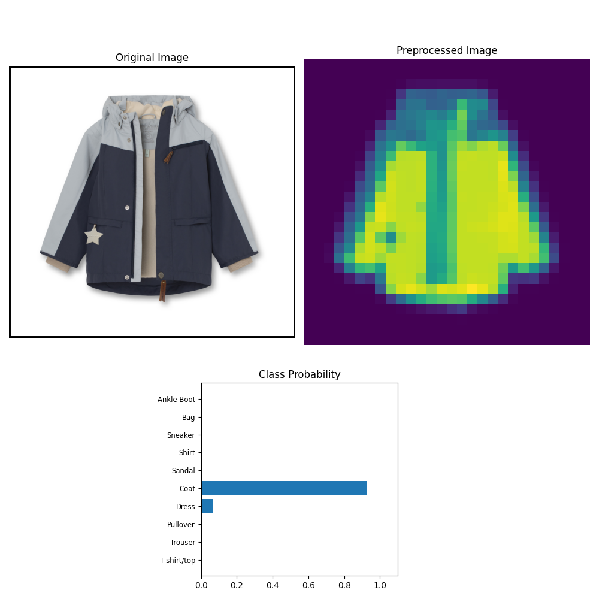

# Clothing Neural Network (CNN*)

## Description

Deep learning application designed for image inference, built with a neural network trained on the Zalando fashion-MNIST dataset https://github.com/zalandoresearch/fashion-mnist. The dataset contains images of fashion items, and the model classifies these images into one of ten categories.



### Model Architecture

The neural network used for training is constructed using the `fc_model.Network` class. Below are the key components:

- **Network Architecture:** The `Network` class in `fc_model.py` defines a fully connected neural network. It takes the input size, output size, and a list of integers representing the sizes of hidden layers as parameters. The architecture can be dynamically adjusted, but in the current project, it is instantiated with an input size of 784, output size of 10, and three hidden layers with sizes [512, 256, 128] respectively:

    ```python
    model = fc_model.Network(784, 10, [512, 256, 128])
    ```

- **Activation Function:** The network uses ReLU (Rectified Linear Unit) as the activation function for hidden layers and LogSoftmax for the output layer.

- **Loss Function:** The negative log likelihood loss function (`nn.NLLLoss()`) is utilized for training the network.

- **Optimizer:** The Adam optimizer is employed with a learning rate of `0.001` to adjust the weights in the network during training.

### Training Details

- **Epochs:** The network is trained for 20 epochs. Each epoch iterates over the entire dataset to update the model's weights based on the calculated loss.

## Table of Contents

- [Installation](#installation)
- [Usage](#usage)
- [Contributing](#contributing)
- [License](#license)

## Installation

### Prerequisites

- Python (version 3.x recommended)
- Libraries and packages: OpenCV, PIL, PyTorch, torchvision, etc.

### Steps

1. Clone the repository to your local machine:
    ```bash
    git clone <repository-url>
    ```
2. Navigate to the project directory:
    ```bash
    cd path-to-project-directory
    ```
3. Install the required packages and libraries:
    ```bash
    pip install -r requirements.txt  
    ```

## Usage

### Image Inference

1. Run the main script with the path to the input image:
    ```bash
    python main.py path-to-input-image
    ```
2. Optionally, skip the image resizing step by adding the `--skip_resize` flag:
    ```bash
    python main.py path-to-input-image --skip_resize
    ```
